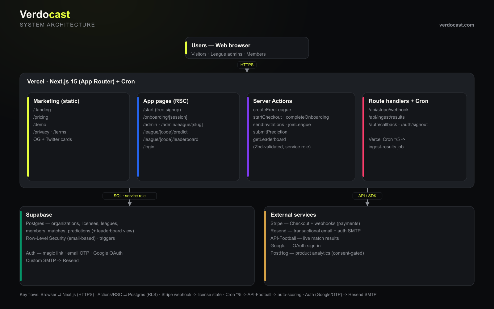
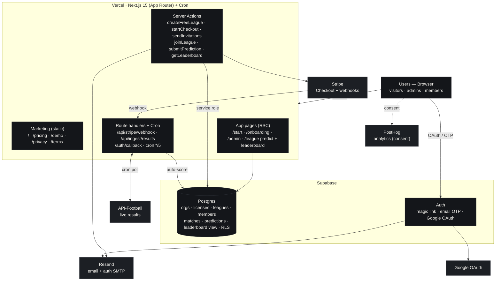

# Verdocast — Architecture

Branded diagram (regenerate with `node scripts/gen-architecture.mjs`):

Live: https://verdocast.com/architecture.png · vector: [architecture.svg](./architecture.svg)

## How it hangs together

- **Next.js 15 (App Router) on Vercel** is the whole app:
  - **Marketing** pages are static (fast, SEO/OG cards): `/`, `/pricing`, `/demo`, `/privacy`, `/terms`.
  - **App pages** are dynamic React Server Components: `/start`, `/onboarding/[session]`, `/admin*`, `/league/[code]/predict`, `/league/[code]/leaderboard`, `/login`.
  - **Server Actions** do the mutations (Zod-validated, service-role DB access): `createFreeLeague`, `startCheckout`, `completeOnboarding`, `sendInvitations`, `joinLeague`, `submitPrediction`, `getLeaderboard`.
  - **Route handlers + Cron**: `/api/stripe/webhook` (license source of truth), `/api/ingest/results` (live scoring), `/auth/callback`, `/auth/signout`; Vercel Cron hits ingest every 5 min.
- **Supabase** is Postgres (the data model + `leaderboard` view + RLS + triggers) and Auth (magic link, email OTP, Google OAuth; custom SMTP via Resend).
- **External services**: Stripe (Checkout + webhooks), Resend (email + auth SMTP), API-Football (live results), Google (OAuth), PostHog (consent-gated analytics).

## Key flows

- Browser ⇄ Next.js over HTTPS; Server Actions/RSC ⇄ Postgres with the service role (RLS is defense-in-depth).
- Stripe `checkout.session.completed` / `charge.refunded` → webhook → license state.
- Cron `*/5` → ingest job → API-Football → on a match finishing, the pure scoring engine writes `points_earned` → leaderboard.
- Auth via Google or email OTP; auth + invitation emails send through Resend.

## Mermaid source

